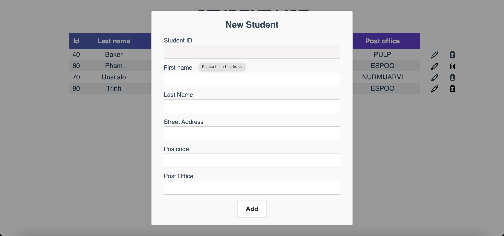

# Java-Student-Data-Management

## Description
This is a web application for managing student data. It allows users to list all students, add new students, and delete existing students. Additionally, it provides the option to update student details.

## Features
- List all students
- Add new students

- Delete existing students
- Update student details 

## Technologies Used
- Java Servlets
- DAO (Data Access Object) pattern
- JDBC (Java Database Connectivity)
- HTML
- CSS
- JavaScript
- SQL

## Files and Directory Structure
- `webAppExercises.css`: CSS file for styling the web pages.
- `index.html`: Main page
- `studentList.js`: JavaScript file for the main page logic.
- `studentAdd.js`: JavaScript file for adding a new student.
- `studentDelete.js`: JavaScript file for deleting student's data.
- `studentUpdate.js` : JavaScript file for updating student details.
- `StudentDAO.java`: Data Access Object class for interacting with the student database.
- `Student.java`: Class representing a student entity.
- `StudentListServlet.java`: Servlet for handling requests related to listing students.
- `StudentAddServlet.java`: Servlet for handling requests related to adding students.
- `StudentUpdateServlet.java` (optional): Servlet for handling requests related to updating students.
- `StudentDeleteServlet.java`: Servlet for handling requests related to deleting students.

## Setup
1. Clone this repository to your local machine.
2. Open the project in your preferred IDE (Integrated Development Environment).
3. Set up the database:
    Download the student_schema.sql file from the repository.
    Open your SQLite database client
3. Execute the SQL commands in the student_schema.sql file to create the necessary tables.
4. Configure the project:
    Make sure your Tomcat server is properly configured in your IDE.
    Set up the project to run on your local Tomcat server.
    Start the Tomcat server and deploy the application.
    Access the application through your web browser:
      Main page: http://localhost:8080/full-stack-project/mainPage

